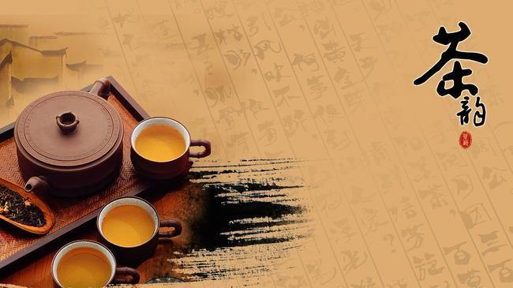

最近喜欢上喝茶。

<!-- more -->
## 1
前些天，从街边淘来一个小茶壶，本来是一组茶具，还包括小茶杯和公道杯，但是盼盼说一是现在地方小没处摆，二是浪费钱，所以考虑良久，没有买一整套。

我本是一个爱安静的人，骨子里也是喜欢古风古气的，唉，碍于没人领入门啊，不然我还真的可能步入佛门。

所以抱着一个小茶壶、一个类似茶盘的鱼盘、四个既可以喝白酒又可以做茶杯的小杯子回来，也算是完成了我的小愿望，因为一直考虑买套茶具。我总是愿意妥协的，愿意为她妥协的，因为她很会过生活，她的决定总是让人放心，即便她已经改变了我的很多坚持，虽然有些改变不太情愿，但是还是知足的。很幸福，不是吗？
## 2
喝茶，要先将茶杯和茶壶热水泡一下，为的是温热均匀，这样沏出来的茶是很香的，我不懂，所以我没感受到，而我的确感受到了另一件事。

倒掉第一泡茶后，将第二泡茶沏好开始品尝，入口味苦而涩，水质偏硬，犹如气盛的青年，味道浓烈，独具个性。第三四泡茶就开始发生变化，苦涩变淡，水质越发轻柔，好似刚刚有了小孩子的成年人，性格开始圆润，而不失活力。而自第五泡茶至第七泡茶，清清淡淡，恰如睿智的老者，不失慈祥和温和。

## 3
常常看到某些上了年纪的老人，一脸的戾气，甚至这些戾气会在很多年轻人脸上看到。当老人越来越为老不尊，当年轻人越无法无天，社会应该考虑是什么改变了古人的智慧。

都说时间会在每个人的脸上刮出沟壑，而一个越活越和蔼的人，才是真正懂得智慧的人。而我们，只是一个自作聪明的物种。

个人博客：[**午后南杂**](http://recoluan.gitlab.io) 