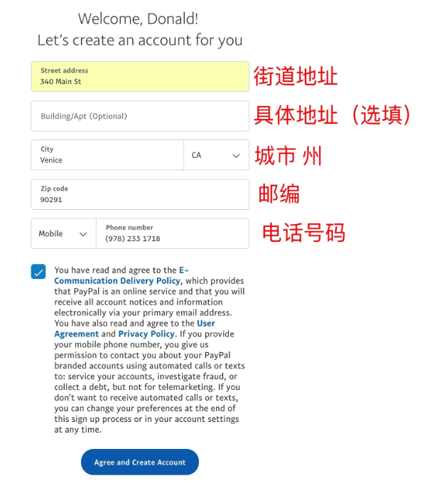

这个过程分为两个步骤：创建美区 ID 和购买信息：

1. 创建美区 ID：[前往](https://appleid.apple.com/account#!&page=create)

    注册时记得将 **国家或地区** 选择为 **美国**，邮箱可以使用微软的 `hotmail` 或 `outlook` ，当然也可以是 `gmail`，尽量不要使用国内邮箱。

2. 当你在 `app store` 中登录时，会提醒你填写购买相关信息，可以仿照下面来填写：

    